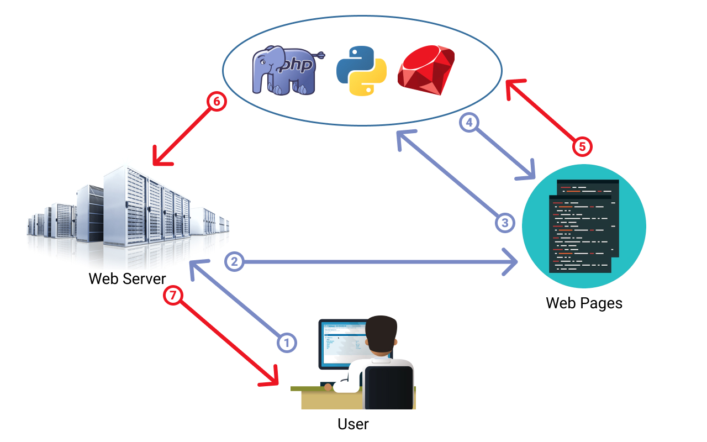
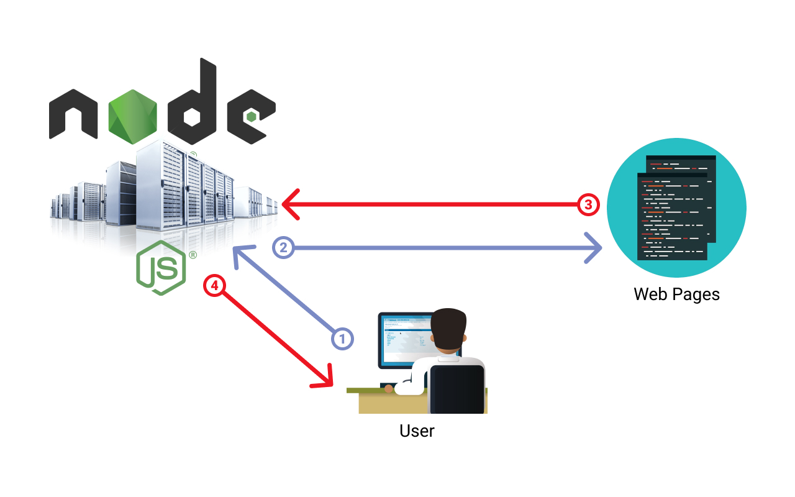

# Блокирующий vs Неблокирующий ввод/вывод
Причина быстрого выполнения Javascript — это Event Loop. В типичной модели сервера приложений, которая использует блокирующий ввод/вывод — в этом случае приложение должно обрабатывать каждый запрос последовательно, приостанавливая потоки, пока они не будут обработаны. Это может усложнить приложение и, конечно, замедлить его работу.

Node.js использует неблокирующий ввод/вывод, в котором потоки (в данном случае последовательные, а не параллельные), могут управлять несколькими запросами. Если его нельзя обработать, он фактически «удерживается» как обещание, что означает, что его можно выполнить позже, не задерживая другие потоки. Весь этот процесс позволяет разработчикам управлять большим количеством операций, используя меньше памяти и ресурсов.

